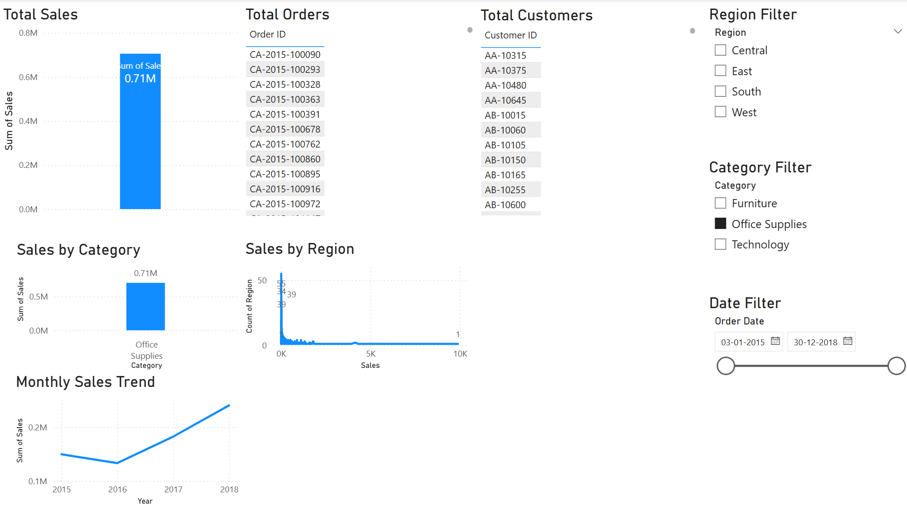

# 📊 Power BI Sales Analytics Dashboard

## 📌 Project Overview
This project is an interactive sales analytics dashboard built using Power BI.  
It helps analyze sales performance across regions, categories, and time periods.

## 🛠 Tools & Technologies
- Power BI Desktop
- CSV Dataset
- Data Visualization & Analytics

## 📈 Features
- KPI Cards: Total Sales, Total Orders, Total Customers
- Sales analysis by Region and Category
- Monthly Sales Trend analysis
- Interactive slicers for Region, Category, and Date

## 🧹 Data Preparation
- Verified and cleaned dataset
- Ensured correct data types for date and numeric fields
- Applied aggregations and distinct counts

## 📷 Dashboard Preview

## 🎯 Key Insights
- Identified top-performing regions
- Analyzed category-wise sales contribution
- Observed seasonal sales trends

## 👩‍💻 Author
Sony Dasari  
Final Year B.Tech (CSE)

